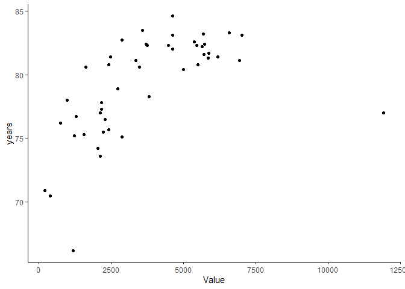

life-expectancy
================

``` r
library(readr)
library(dplyr)
```


    Attaching package: 'dplyr'

    The following objects are masked from 'package:stats':

        filter, lag

    The following objects are masked from 'package:base':

        intersect, setdiff, setequal, union

``` r
library(countrycode)
```

    Warning: package 'countrycode' was built under R version 4.3.2

``` r
library(priceR)
```

    Warning: package 'priceR' was built under R version 4.3.2

``` r
library(ggplot2)
```

``` r
life_exp <- read_csv("data/DP_LIVE_11122023092440528.csv")
```

    Rows: 8449 Columns: 8
    ── Column specification ────────────────────────────────────────────────────────
    Delimiter: ","
    chr (6): LOCATION, INDICATOR, SUBJECT, MEASURE, FREQUENCY, Flag Codes
    dbl (2): TIME, Value

    ℹ Use `spec()` to retrieve the full column specification for this data.
    ℹ Specify the column types or set `show_col_types = FALSE` to quiet this message.

``` r
health_spend <- read_csv("data/SHA_11122023093838475.csv")
```

    Rows: 23231 Columns: 21
    ── Column specification ────────────────────────────────────────────────────────
    Delimiter: ","
    chr (15): HF, Financing scheme, HC, Function, HP, Provider, MEASURE, Measure...
    dbl  (6): TIME, Year, PowerCode Code, Reference Period Code, Reference Perio...

    ℹ Use `spec()` to retrieve the full column specification for this data.
    ℹ Specify the column types or set `show_col_types = FALSE` to quiet this message.

``` r
exp2020 <- life_exp |> 
  filter(TIME == 2020 & SUBJECT == "TOT") |> 
  group_by(LOCATION) |> 
  summarise(
    years = Value
  )
```

``` r
# Plot per capita expenditure

spend2020 <- health_spend |> 
  filter(
    `Financing scheme` == "All financing schemes",
    Function == "Current expenditure on health (all functions)",
    Provider == "All providers",
    Measure == "Per capita, current prices, current PPPs",
  )

full2020 <- full_join(spend2020, exp2020,
          by = "LOCATION")

ggplot(full2020, aes(Value, years)) +
  geom_point() +
  theme_classic()
```

    Warning: Removed 3 rows containing missing values (`geom_point()`).


